# Basics
 

Section - 1: Introduction

* MongoDB Data structure:  

* MongoDB data format (document-oriented storage format):

* BSON data-format and what is under the hood:

* MongoDB Ecosystem:

* Work with MongoDB:

* Implicit operations in Mongo:

## Start working with MongoDB

To add mongo command to your command line:  
<b> win - environment variables - advanced tab - environment variables</b>  
Add here a path to your mongoDB.

[useful link](https://dangphongvanthanh.wordpress.com/2017/06/12/add-mongos-bin-folder-to-the-path-environment-variable/)

<b>BTW</b>, to continue working with course you have to stop MongoDB service and start db manually
using "mongo" command from a console. Without it "mongo" command will open mongo service instead of real db.

to stop service - open CMD as admin and `net stop Mongo`

<b>Last step:</b>  
* To make default data storage location: create "data" folder in C: drive and put folder "db" within.
* Otherwise: create another directory (i.e. D:\mongodb-data\db) and put command in cmd:
`mongod --dbpath D:\mongodb-data\db`

<b>Pay attention:</b>
You have to leave your process running (cmd console should be opened) to work with mongoDB service.

* CMD - `mongo`

And now you are in the mongo shell where you can run your commands and queries.

Section - 1: Simple commands

* `show dbs` - will show existing dbs in selected repository (`--dbpath D:\mongodb-data\db`)
* `use Your_db_name` - will switch to db with the selected name. If db does not exist - it will create it automatically.
* `db.products.insertOne({name: "A Book", price: 29.99})` - will create a table named products (it does not exist too) 
in db which we connected to and insert a document inside it.  
Pay attention on non-existing quotation mark in "keys" - you can use key naming without quotations, they will be added
under the hood.  

Here is a console output. InsertedId - generated uniqueId for this insert, acknowledged - it confirms that this data is inserted.

* `db.products.find()` - retrieves you all data from collection (from table in SQL world).
* `db.products.find().pretty()` - show this data formatted.

Section - 2: JSON-vs-BSON, Basics & CRUD operations

### Summary

### Json vs Bson:

* You can set _id field manually and do not rely on autogenerated id.
BTW, you can't insert another document with the same _id.

## CRUD Operations:

### Read 
Simple filter: `db.flight.find({intercontinental: true}).pretty()`;
Greater than ($gt): `db.flight.find({distance: {$gt: 10000}}).pretty()`;
FindOne: `db.flight.findOne({distance: {$gt: 10000}})`

### InsertMany and Show results using find. Cursor  
Find does not show you an entire result set, it shows you a cursor by default:  

* Bare in mind that mongodb will increment Id to keep the proper element's order. First came element will contain minor identifier:

### UpdateOne
`db.flight.updateOne({distance: 12000}, {$set: {marker: "new field delete"}})` - will update first document which contains distance: 12000.  
Pay attention on <b>$set</b> - all reserved words start from dollar sign. 
This operator means that you are able to update your document and add a new field.

### UpdateMany
`db.flight.updateMany({}, {$set: {marker: "to Delete!"}})` - empty curly braces `{}` mean all documents in collection.

### Update
`update` operation works like `updateMany`:  

As you may have noticed first modification using set to `delayed: true` has no modified results because our document already
has this value. When we changed the value to false - log shows us that our value has been changed.

The difference between them - you can use it without `$set` operator, update does accept this syntax.
But it works on another manner:

It will override all key-value pairs in document!

It works very close to `replaceOne`:

### Delete
`db.flight.deleteOne({departureAirport: "TXL"})` - departureAirport: "TXL" will be used as filter to find what exactly
 we want to delete from collection. Only first found a document with "TXL" will be deleted.

### forEach
It is possible to use .forEach operation after find() to do something with every element after filtering:
`db.passengers.find().forEach((passengerData) => {printjson(passengerData)})` - Bear in mind that `forEach` uses syntax according
your MongoDB driver. Shell uses Nodejs syntax.

Pay attention:
That's why you can't use `pretty()` after findOne() method - `pretty()` is a method of a Cursor, findOne does not return cursor,
(and `pretty()` does not exist for a single value), findOne returns a sole value.

Section - 2: Projection

### Projection
Projection means a mechanism to avoid overfetching from database.  
You can use it as a parameter in `find` method:
* `find({}, {name: 1})` - first parameter is a filter, the second is projection. 1 means - "include this data".

By default it will send you objects with _id (because it is a default property) and "name".

* To exclude _id (or any other field) - `find({}, {_id: 0})` - 0 means exclude.

To only name - `find({}, {name: 1, _id: 0})`/

# Data Structure, Schemas, Relations, Validation

Section - 2: Embedded Documents & Arrays

## Array examples:

  
## Simple arrays with find method

## Array of objects with find method
to use find in embedded document you have to use ".":
`find({"status.description": "your_value"})`

description is an embedded document inside status.  
Pay attention that you must use double quotation around `status.description`.

Section - 3: Schema Basis

* SQL Approach (the same structure for all documents):  
You can assign null to your property. The value of such property will not be assign, but the property will be shown
in your data structure.
`db.products.insertOne({name: "Book", details: null})`

Section - 3: Data Schemas, Data Modelling

Section - 3: Data Types, Limits and Statistic

[good link about how mongodb works inside](https://www.datadoghq.com/blog/monitoring-mongodb-performance-metrics-mmap/)

* Data Types:

* to get statistic from your database you have to use `stats()` command;

To prove that it stores a number instead of float you can use `typeof db.numbers.findOne().a` command.

* MongoDB has a couple of hard limits - most importantly, a single document in a collection (including all embedded documents it might have) must be <= 16mb. Additionally, you may only have 100 levels of embedded documents.
[additional-info](https://docs.mongodb.com/manual/reference/bson-types/)

1. NumberDecimal creates a high-precision double value => NumberDecimal("12.99")
2. NumberInt creates a int32 value => NumberInt(55)
3. NumberLong creates a int64 value => NumberLong(7489729384792)

Section - 3: Relations

##One to One Relations

* Example with one-to-one relations and call the data using two steps and variable:

It's not the best option of storing data. In such case better to store data like embedded data inside patient document.
In most cases better to use embedded approach. 

* Another one-to-one examples, but using references. You still opt to use different collections: 
It could be possible useful if you try to analyze your data. And it's very good if your data stores in different
collections (for load balancing, for example. Or because we are interesting only in cars).

##One to Many Relations

* And brief example of ref and embedded approaches:

* Additional example:

##Many to Many Relations

* Sql World approach with 3 tables, one of them stores a joint data:

* MongoDB Approach:

It allows us to use references within one of the data tables.
Advantages from sql and mongo worlds.
Also no reason to use fully embedded approach for some reasons (over-fetching, possible not up-to-date data and so on).

* Summary:

## Merging And Joining with $lookup()

* Initial doc is:

* And the result of aggregate + lookup operator:

Section - 3: Schema Validation

* To declare validation for new collection you have to use explicit collection creation using `createCollection` method.
first  parameter is a new collection name.  
second parameter is its structure: validator + $jsonSchema = validate the schema.
1. Right now $jsonSchema is strongly recommended approach.
2. bsonType: "object" - every coming element should be object-like.
3. required: [] - array of required fields.
4. description - error message.
5. items - you can define nested elements validation.
6. validationAction: 'warn' - only warns you about errors in validation, but not blocks you to send a new document.
<pre>
db.createCollection("newNameOfCollection", {
validator: {
    $jsonSchema: {bsonType: "object", required: ["title", "text", "creator", "comments"], 
    properties: {
     title: { bsonTYpe: "string", description: "must be a string and is required" },
     text: { bsonType: "string", description: "must be a string and is required" },
     creator: { bsonTYpe: "objectId", description: "must be an object and is required" },
     comments: { 
        bsonTYpe: "array",
        description: "must be an array!"
        items: { 
            bsonType: "object",
            required: ["text", "authors"] 
            properties: {
                 text: {
                     bsonType: "string",
                     description: "text must be a string!!"
                 },
                 author: {
                     bsonType: "objectId",
                     description: "author must be an objectId"
                 }
               }
            }
        }
    }
}})
</pre>

* To add\modify validation to already existed collection you have to:
<pre>
db.runCommand({
    collMod: "posts",
    validator: { ...YOUR_VALIDATION_STRUCTURE_AS WE DID BEFORE }
    validationAction: 'warn'
    })
</pre>

this code will succeed. You could see a warning in the log file.(next lecture).

# MongoDB Settings, Data Exploration, Data Visualization

Section 4: MongoDB Settings (As Process and Service), Configuring DB, Log Path

#### mongod parameters

`--directoryperdb` - each db will be stored in a separate directory (under defined by --dbpath)
 Instead of collection of files - collection of nested folders.

* Linux:
`--fork` - fork process. Works only for Linux. 
[mongodb start vs mongod --fork](https://stackoverflow.com/questions/21329618/whats-the-difference-between-service-mongodb-start-and-mongod/48459859)
to kill MongoDB service process: `use admin` to switch to admin database. And `db.shutdownServer()`;

* Windows:
To run background MongoDB as background service: `net start MongoDB`.  
This command provides you ability to run Mongo as background service.
to kill MongoDB service process: `net stop MongoDB`.

### Save your configurations into configuration file and use it
[configuration file example](Section-4/mongod-configuration-example.cfg)  
To use config file with mongod:
`mongod --config C:/mongod-configuration-example.cfg`
or
`mongod --f C:/mongod-configuration-example.cfg`

It allows you to make a snapshot or blueprint of your mongod configurations.  
Another useful information could be found at mongodb documentation.

### Help
to use help just type help:  
`help admin` - administrative help  
`help connect` - connecting to a db help  
`help keys` - key shortcut
`help misc` - misc things to know
`help mr` - mapreduce.

Section 5: Using the MongoDB Compass to Explore Data Visually

The MongoDB Compass Docs:   
[https://docs.mongodb.com/compass/master/install/](https://docs.mongodb.com/compass/master/install/)  
Full free version of CompassDB is available free for community.

You can use compass to create databases, collections and documents.

Additional features:

# MongoDB Operations

Section 6: CREATE operation, importing documents, additional information

Available methods:

### Insert
* insert method also works, but not recommended.

* For example after using `db.persons.insert({name: "Phil", age: 25})` you do now await does this new person have an Id or not, but it has.  
Unlike the insertOne method insert does not show you its new "_id". It could be a real disadvantage, because in real create
operations you want to get an Id of just created object and then - immediately use it in your app (It's an extremely helpful in most cases).

The same story vs insertMany. Its output is not very helpful at all:

### InsertMany
If you use insertMany and send elements with non-unique declared "_id" field - it will raise an error, 
but all elements until <b>first</b> error will be successfully added.  
 
* For example, this one will fail after trying to add "cooking" again:

* It does not rollback elements which succeeded in inserting.

* To change this behavior you have to use second argument in insertMany method, <b>ordered</b>:  
ordered option will specify how your insert works. If you set it to `ordered: false` all your elements except failed will be inserted.  
In other words, it will continue inserting after fail.

* Tip: To Rollback your insert entirely you have to use transactions from transaction module.

### WriteConcern

* What w:0 allows you - it allows you to get immediate response without waiting real data adding to any instance.
The response will be "acknowledge: false" - which means "we are not sure does your request reach the server or not".  
It is super fast, but obviously it does not let you know anything about operations.

* Why storage engine does not store document on the disk first?
because this operation could be quite heavy (take care about indexes, for example), better to store the info into the 
memory first and after that - set it to the disk using "journal ("TODO")".

* Timeout option allows you control create operation time in situations with bad network connection, for example.
in milliseconds.

* Journal parameter (undefined or false is a default parameter):

### Atomicity

# Importing Data
to import data from json file you have to use `mongoimport`. This command is available globally (not from Mongo terminal mode).
`-d` -database
`-c` -collection name (could be implicitly created)
`--jsonArray` - let your command to know that you send multiple objects, not only one
`--drop` - drop collection before adding (if the collection exist and not empty)

Section 7: READ Operations

## Structure:
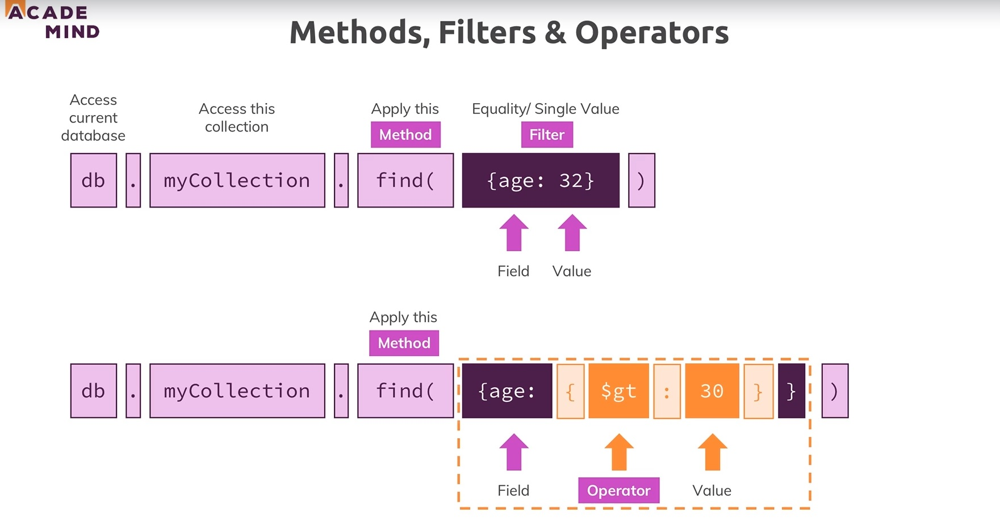
### Operators:
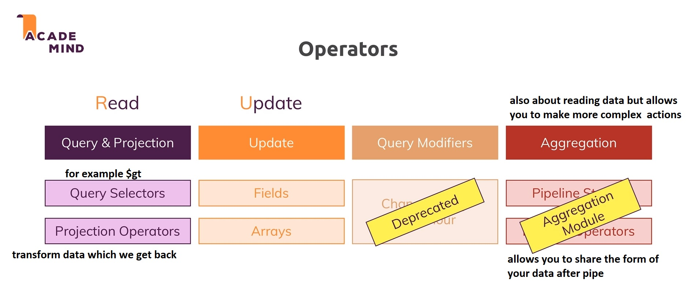
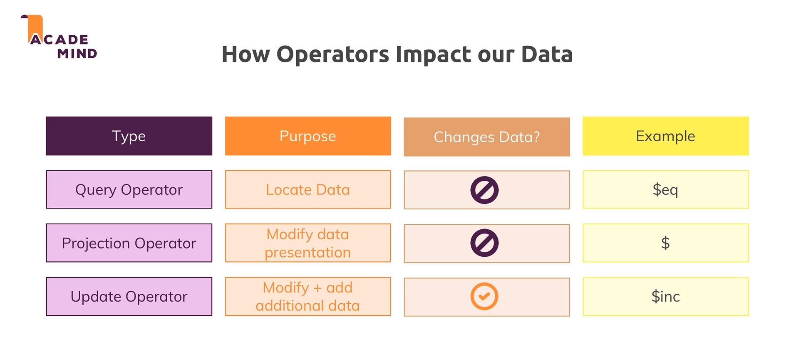

#### Comparision Operators:
1. Examples how to work with top-level properties:
`db.movies.find({runtime: {$eq: 60}})` == `db.movies.find({runtime: 60})`
It's also possible to use not equal operator using `$ne`.
Others could be found in the official documentation.

2. How to work with non-top level properties (because we possibly have lots of embedded fields):
`db.movies.find({"rating.average": {$lt: 60}})` - average is lower than 60.

**Hint 1**: Is you have some genres for your movies in the array, and you try to find "Drama" movies with
`db.movies.find({genres: "Drama"}).pretty()` it also returns you movies with the array of genres where "Drama" is included in.
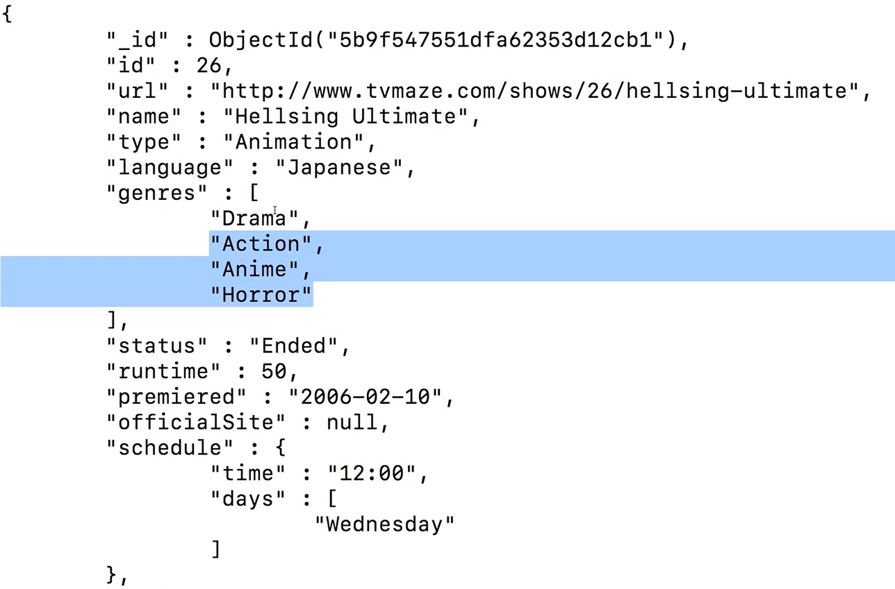

If you want to find exact films with only "Drama" in array you have to use next operator:
`db.movies.find({genres: ["Drama"]}).pretty()` - will return you only Drama in an array.

**Hint 2**: Pay attention on capital "D" in "Drama" equality. If you try to find any movie with "drama" genre - it will not return you anything.
Case sensitive searching.

#### Logical Operators (nor, or, not, and):
* OR (which means composition of 2 operators):  
`db.movies.find({"rating.average": {$or: [{"rating.average": {$lt: 5}}, {"rating.average": {$gt: 9.3}}]}})` - returns all movies where average rating
is lower than 5 or greater than 9.3.

* NOR very similar with OR:
`db.movies.find({"rating.average": {$nor: [{"rating.average": {$lt: 5}}, {"rating.average": {$gt: 9.3}}]}})` - returns you all movies
Where all conditions do not work (not higher than 9.3 and not lower than 5). Simply say it's the inverse of our previous check.

* AND:
`db.movies.find({"rating.average": {$and: [{genres: "Drama"}, {"rating.average": {$gt: 9.3}}]}})`

The alternative of that is:
`db.movies.find({"rating.average": {$gt: 9}, genres: "Drama"})` - it works the same because by default MongoDB has the concatenation mechanism.  
But what the point of having 2 different ways to get the same results?  
**Here the answer**:  
`db.movies.find({genres: "Horror", genres: "Drama"})` - works in command prompt, but prohibited in Javascript because you can't declare 2 objects keys
with the same name.  
`db.movies.find({$and: [{genres: "Horror"}, {genres: "Drama"}]})` - but this one will work like a charm.  

**But pay attention.**  
`db.movies.find({genres: "Horror", genres: "Drama"})` option will return you results with movies which have
single genres "Drama" or "Horror". Why is that? Because it replaces previously declared "genres" with new value "Drama" (which was declared the last):  
How to check that?  
`db.movies.find({genres: "Horror", genres: "Drama"}).count()` - 23 elements.  
`db.movies.find({genres: "Drama"}).count()` - 23 elements.  
 
**Conclusion**: if you need to use and with one field - you have to use `$and` syntax.

* NOT:
Inverts the result of your filter:  
`db.movies.find({"runtime": {$not: {$eq: 60}})` - not equal to 60.
`db.movies.find({"runtime": {$ne: 60}})` - not equal to 60 too.

#### Element Operators:
Allows you to work with the data of different types - for example when phone number has integer type and string type.
Also, it allows you to check does this property exist and so on:

##### $exist:
`db.users.find({age: {$exists: true}}).pretty()` - shows you which documents have declared age field.  
Pay attention it will return you documents with defined age with "null" value as well.  
To avoid that let's do next:
`db.users.find({age: {$exists: true, $ne: null}}).pretty()` - will return you documents with defined age which is not null.

###### $type:
`db.users.find({phone: {$type: "double"}}).pretty()`
`db.users.find({phone: {$type: ["double", "string"]}}).pretty()` - works as well if you would like to check on multiple types.

###### $regex allow you to search with text (But be aware it has no super performance, especially with big texts, better to use indexes):  
`db.movies.find({summary: {$regex: /musical/}})` - for example it will look for "non-full equality".
But again, it's not the best way of doing that.  
Example:
1. Data:  
`{
               "_id" : ObjectId("5f0f2d0c461a206f6b3ab0a8"),
               "volume" : 100,
               "target" : 120
}
{
               "_id" : ObjectId("5f0f2d0c461a206f6b3ab0a9"),
               "volume" : 89,
               "target" : 80
}
{
               "_id" : ObjectId("5f0f2d0c461a206f6b3ab0aa"),
               "volume" : 200,
               "target" : 177
}`

###### $expr:
2. Find all elements where volume is higher than target:
`db.sales.find({$expr: {$gt: ["$volume", "$target"]} })`  
* $expr - expression
* "$volume" and "$target" - name of the fields 

2.1 It also could be more complex. For example find elements where volume is also higher than additional const value + target is higher than some const value:
`> db.sales.find({$expr: {$gt: [{$cond: {if: {$gte: ["$volume", 190]}, then: {$subtract: ["$volume", 30]}, else: "$volume"}}, "$target" ]}})`
* $cond is related to expression $expr. Condition `$cond` allows you to describe complex conditions.
this condition must be `$gt` greater than `"$target"`.
* $subtract - subtract one value from another
* if then else condition
Result:
`{ "_id" : ObjectId("5f0f2d0c461a206f6b3ab0a9"), "volume" : 89, "target" : 80 }` - because only this documents suits to our condition

if we change our subtract from 30 to 10:
`> db.sales.find({$expr: {$gt: [{$cond: {if: {$gte: ["$volume", 190]}, then: {$subtract: ["$volume", 10]}, else: "$volume"}}, "$target" ]}})`  
Result will be:  
`{ "_id" : ObjectId("5f0f2d0c461a206f6b3ab0a9"), "volume" : 89, "target" : 80 }
 { "_id" : ObjectId("5f0f2d0c461a206f6b3ab0aa"), "volume" : 200, "target" : 177 }` - two values instead of one in the result set.

##### Querying Arrays ($size, $all, $elemMatch):
to find something through complex objects in arrays, for example nested object  
`hobbies: [{title: "Sports", frequency: 3}, {title: "Cooking", frequency: 2}]`
Answer:  
`db.users.find({"hobbies.title": "Sports})` - you can use this operator for nested arrays. Will query all documents which include Sport in hobbies array.

* $size, $all  
Find all movies with genres action and thriller AND size or genre array should be 2. Will query only movies with exact genres.  
`db.movies.find({$and: [{genre: {$all: ["action", "thriller"]}}, {genre: {$size: 2}}]}).pretty()`

* $elemMatch  
Find all users who have hobby "Sports" with frequency 2. Data:  
`hobbies: [{title: "Sports", frequency: 3}, {title: "Cooking", frequency: 2}]`
Answer:  
`db.users.find({$and: [{"hobbies.title": "Sports"}, {"hobbies.frequency": 2}]})` - will not work. It will find all documents with independent values. For example if someone has any hobby with frequency 2 + Sports with frequency 3.  
Here we basically can use $elemMatch:  
`db.users.find({"hobbies": {$elemMatch: {title: "Sports", frequency: 2}}})` - will work.  
**Pay attention on "title" - i use it without writing parent node "hobbies.title" because it returns you the nested document**
 
* Additional example: to find all movies where rating array contains only values between 8 and 10 (using $all and $elemMatch):  
Data Structure:  
`{
         "_id" : ObjectId("5f0f3ddeb1feccd1e8f78a67"),
         "title" : "Supercharged Teaching",
         "meta" : {
                 "rating" : 9.3,
                 "aired" : 2016,
                 "runtime" : 60
         },
         "visitors" : 370000,
         "expectedVisitors" : 1000000,
         "genre" : [
                 "thriller",
                 "action"
         ],
         "ratings" : [
                 10,
                 9,
                 9
         ]
}`  
Answer:   
`> db.movies.find({ratings: {$all: [{$elemMatch: {$gt: 8}}, {$elemMatch: {$lt: 10}} ]}}).pretty()`

Section 7: Cursors behind the scene

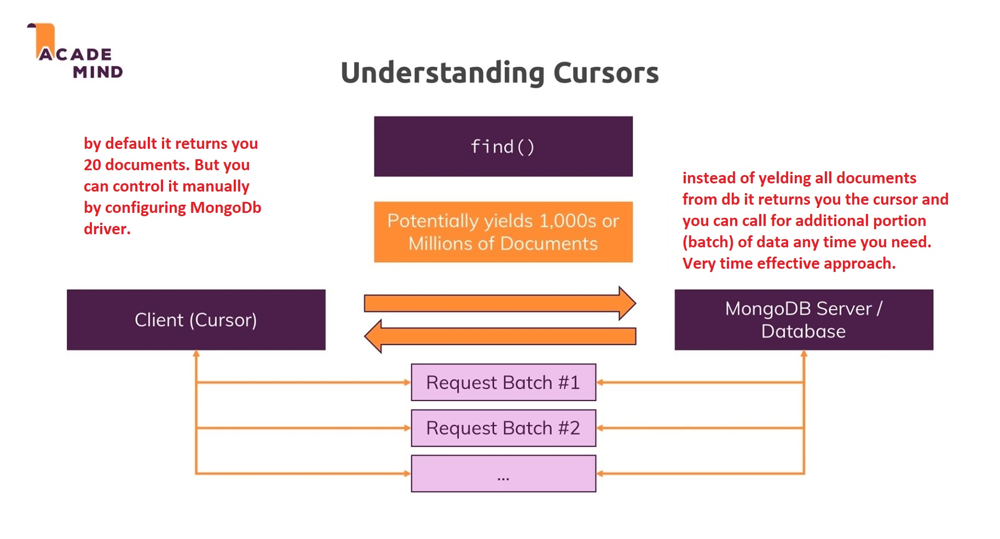

#### Cursors. Base understandings and additional functions.

* `count()` - using count with a cursor you can find out how much documents you can get.
`db.movies.find().count()`
BTW, when we make such call - we make a call to memory, not to data which comes from file. It happens because after his inner command "run"
it places data into the memory.

* `find()` - when you make a call with find() from the console you can type "it" to get next batch of documents. The MongoDb driver has another command and mechanism to
make the same.

* `next()` - this method works in console and directly with mongoDb driver.  
`db.movies.find().next()`

1. If you call `next()` several times - it will return you the same element? Why? because it executes it from scratch.  
If you store somewhere your dataCursor and make the `next()` call from it - it will return you next element every time.

Example:  
`const dataCursor = db.movies.find() dataCursor.next()`
if you call dataCursor - it will return you 20 documents again.  

2. `forEach` - another operation which could be used with cursor.  
Example:  
`dataCursor.forEach(doc => {printjson(doc)})`. printjson - method provided by MongoDb driver which prints your document on the screen.
**Pay attention. You will no longer able to use "it" to see more. After using forEach with the cursor it will return you all remain documents in db (obviously after prev next() calls)**

3. if you make a call to `next()` after `forEach` - it will show you an error because the cursor will be exhausted.  
You can check it using `hasNext()` function with cursor: `dataCursor.hasNext()`, With hasNext you can safety use `next()`.

#### Cursors. Sorting results.
You can sort alphabetically, or by number. You have to call it after `find()` and before `pretty()`.
`db.movies.find().sort({"rating.average": 1}).pretty()`  
1 - means ascending  
-1 - descending. Returns doc with the highest average rating first.

You can use several sorting fields:  
`db.movies.find().sort({"rating.average": 1, runtime: -1}).pretty()` - by average rating, then by runtime.

* Tip: For obvious reasons sort is available only for cursors after find, it is not available after findOne().

#### Cursors. Skipping and Limiting.
* `skip()`. You can use skipping for pagination on your website, for example.  
`db.movies.find().sort({"rating.average": 1, runtime: -1}).skip(10).pretty()` -- skip 10 documents.
We are also able to skip much higher than 20 (default cursor documents amount). It is possible to `skip(100)` for example.

* `limit()`. Limit allows you to limit amount of documents retrieving by the cursor.  
Interesting detail.
`db.movies.find().sort({"rating.average": 1, runtime: -1}).skip(10).limit(10).count()` - returns you total amount of documents in the collection.  
But if you try to see results by `db.movies.find().sort({"rating.average": 1, runtime: -1}).skip(10).limit(10).pretty()` - it will return you only 10 elements.
This method is also very useful for pagination.

**Pay attention. Orders of the methods matter! It matters when you use directly with a driver. But using with a cursor it doesn't matter, cursor place it in the right order for you under the hood!**

#### Cursors. Projection.
##### Projection for objects and embedded documents:  
* Using projection you can control which data returned. What does it mean? It means how we extract the data fields.  
To do that you have to pass second argument to `find`. First one is responsible for the filter criteria.  
`db.movies.find({}, {name: 1, genres: 1, runtime: 1, rating: 1, image: 0}).pretty()` -- all fields which are not mentioned here (or if they were mentioned explicitly with 0) - are not included.  
* There are one exception - _id field. It is included if you don't specify it with 1. You can exclude it  set to 0 explicitly:  
 `db.movies.find({}, {name: 1, genres: 1, runtime: 1, rating: 1, image: 0, _id: 0}).pretty()`
* you could also project for embedded documents:  
 `db.movies.find({}, {"schedule.time": 1}).pretty()` - will return you a schedule embedded document only with mentioned field. Other fields will not be included.

##### Projection for arrays:

1. `db.movies.find({"genres": "Drama"}, {"genres.$": 1})`  - This query means that we're filtering every movie by genres which include "Drama" (genres is an array). But after that we tell to mongo to fetch only first genre from the array.  

Another example: 
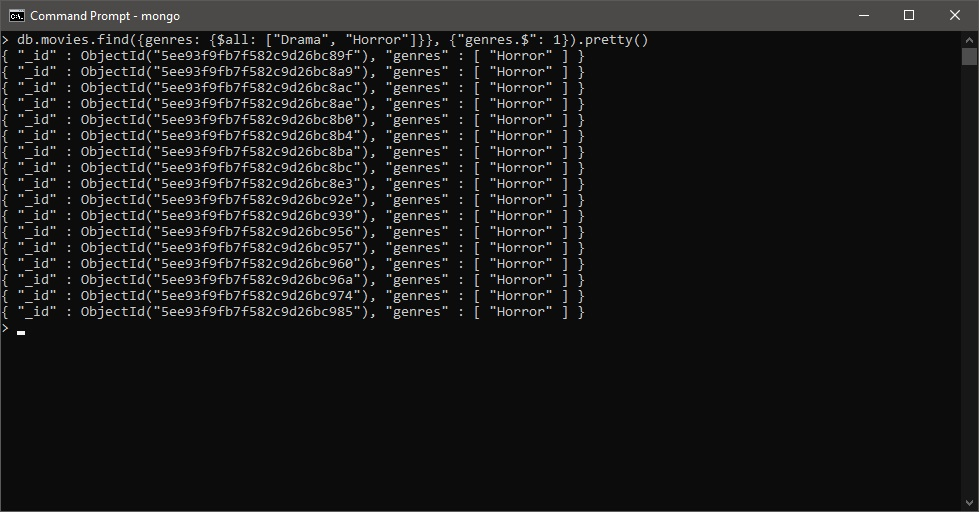
It looks a bit strange. Let me explain how it works. Technically "Horror" is a first matching element. Drama is lower. That's why after projection we see only him.

2. `$elemMatch`. Sometimes your want to pull some items which are not you queried for. In a such case you can use $elemmatch. It also available for you in projection.  
`db.movies.find({"genres": "Drama"}, {genres: {$elemMatch: {$eq: "Horror"}}})` 
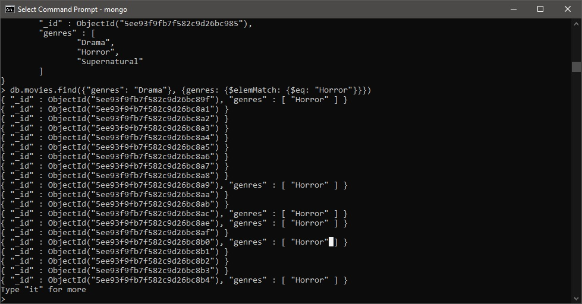
You see empty field because "Horror" did not simply include into them.

##### Projection. $slice for arrays.
`$slice` allows you to pull specified amount of elements from array.
`db.movies.find({"genres": "Drama"}, {genres: {$slice: 2}, name: 1}})` - this example will return you series with name, id(added by default) and 2 genres.  
With slice operator you can use array form:
`db.movies.find({"genres": "Drama"}, {genres: {$slice: [1, 2], name: 1}})` - first parameter is amount of elements what you would like to skip. The second one - is the amount of element to pull.

Section 9: Update Operation

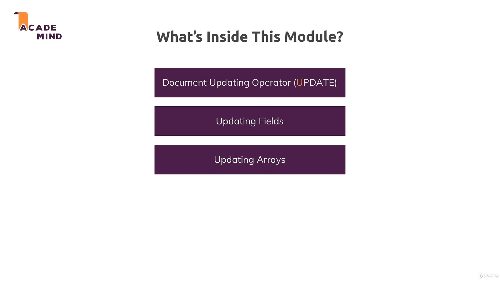
#### Updating fields using "updateOne()", "updateMany()" and $set.

Section 9: Delete Operation

1. `deleteOne` operator let you delete one with query selector:  
`db.persons.deleteOne({name: 'Chris'})`

2. `deleteMany` let you delete several records match your condition:  
`db.persons.deleteMany({age: {$gt: 30}, isSporty: true}})`
`db.persons.deleteMany({age: {$exist: false}, isSporty: true}})`

3. to delete all records in collection:  
`db.persons.deleteMany({})`
`db.persons.drop()` - but pay attention, for the application it's not a typical task, and you should add some restriction to  forbid such action.
Delete some records is okay, but drop of all collection looks like a strange wish. 
`db.dropDatabase()` - to drop the entire database. To drop it you must first use another database using `use` operator and then call `dropDatabase` on your target you need to delete.

Section 10: Explain, Query Diagnosis and Efficient Query Planning, Rejecting the Plan

#### Explain()
To understand what mongoDB did and how it derived results for any commands (except insert) you can use `explain`:
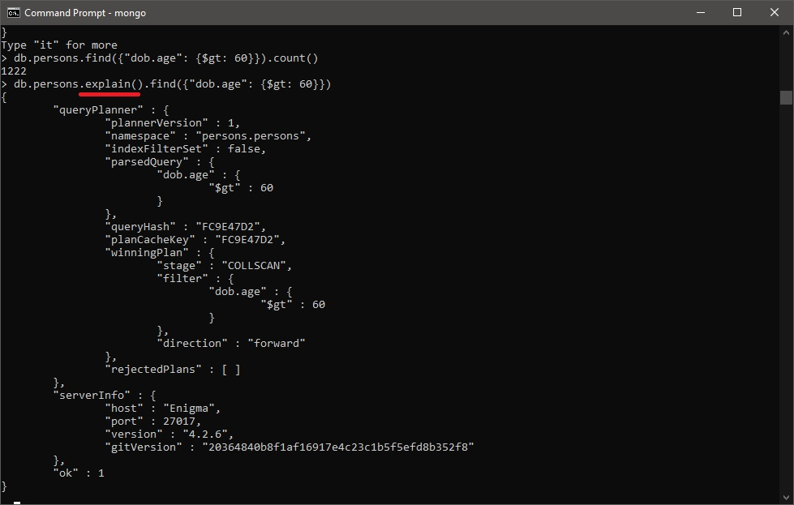
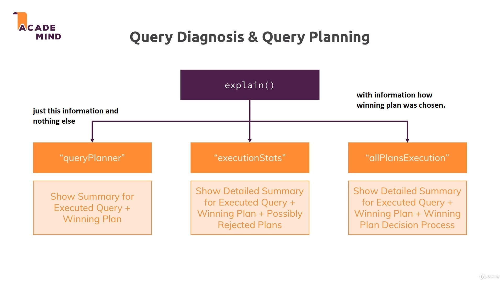

* Under `winning plan` you might notice stage: COLLSCAN. It means it looked throughout entire collection to find a result set.
* Also here is `rejectedPlans` - plans which were tried, but they were worse than winning by performance.
This property is an empty collection because of no plans except COLLSCAN to find all results in a current situation.

Explain has a bunch of commands:
`db.contacts.explain("executionStats").find({"dob.age": {$gt: 60}})` - detailed explanation.
* `"executionTimeMillis" : 0,` - tells you about execution time.
* ` "totalDocsExamined" : 5000,` - docs in our collection (because of COLLSCAN).  

### Efficient Queries 
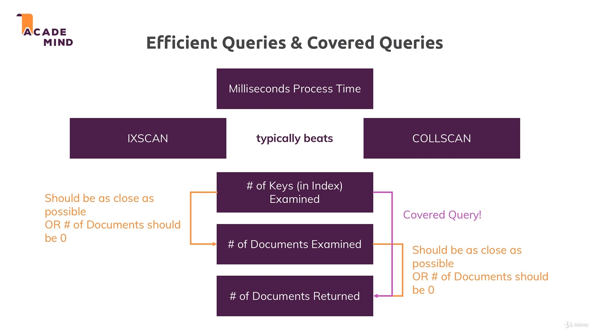
Let's discuss "totalDocsExamined" parameter. It should be as low as possible. For example, if you are looking for a document
with name "Max" in your collection, and you have an index on this field - you will notice the "totalDocsExamined" value will not be null (even if you have a one document in your collection).  

Index has not only pointer to the document, but also a value - in this situation the name will be his value. To avoid this extra-examination - let's change our query from  
`db.persons.explain("executionStats").find({name: "Max"})`  To `db.persons.explain("executionStats").find({name: "Max"}, {_id: 0, name: 1})`.  
You will notice 'totalDocsExamined' will become 0. It will use the value "Max" directly from the index, but not from the pointed data itself.

### How mongoDB rejects the plan
How exactly does mongodb figure out which plan is better?  
1) Mongo does through indexes which could help you with your query. (for example if you have an index for 2 fields - should mongo use only first field from an index or both)
`db.persons.createIndex({"dob.age": 1, name: 1})`  
`db.persons.find({name: 'Max', age: {$gt: 29}})`. One of the rejected plans will be the plan which uses only age field (it can't use a name field because name is not on the first place)
MongoDb does the race for approaches between each other and tests which one can query 1000 documents first.  
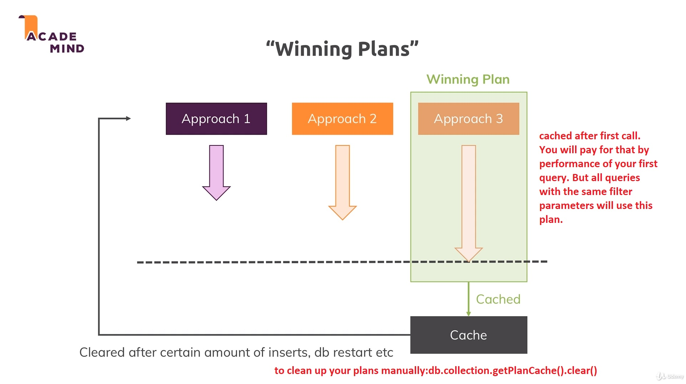

Another options why mongodb will make the race again:
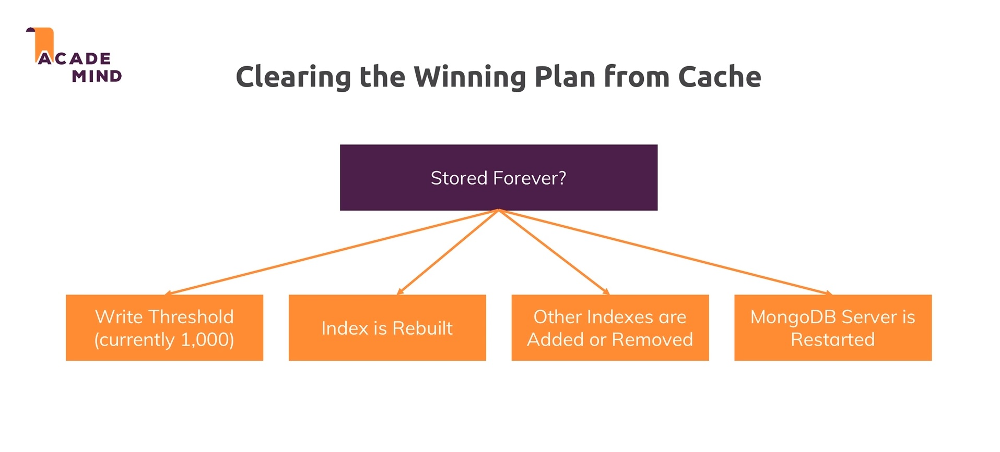

* To understand which plans had a race you have to call `db.persons.explain("allPlansExecution").find({name: 'Max', age: 29})`.  
It will scan all indexes for you and how they perform with your data with comparisons how long they would take in different combinations or entirely without them.

# Indexes

Section 10: Indexes

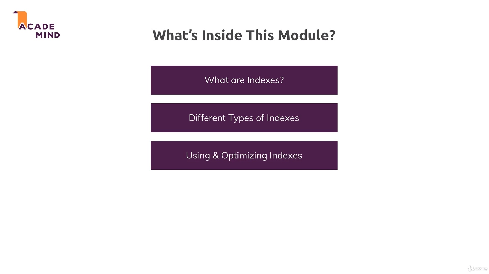
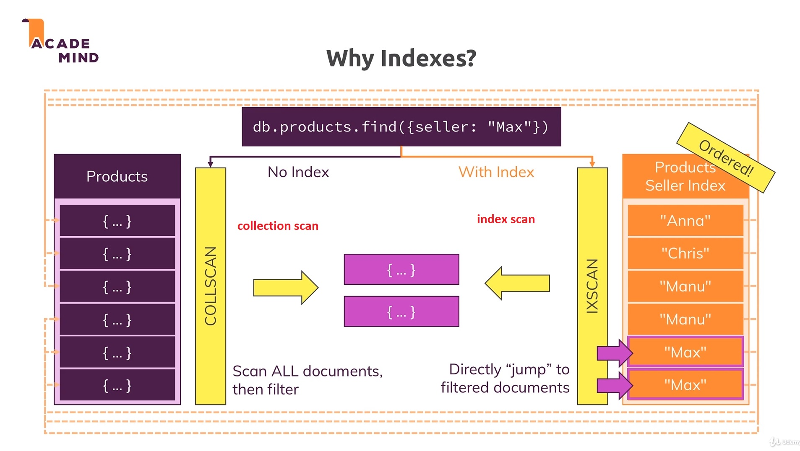
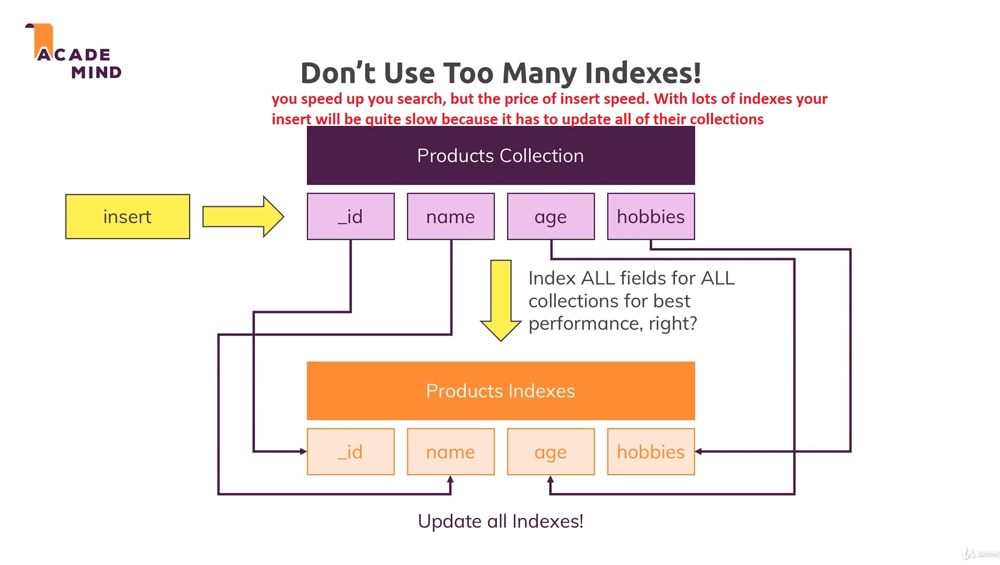

### 2 Ways how to create indexes
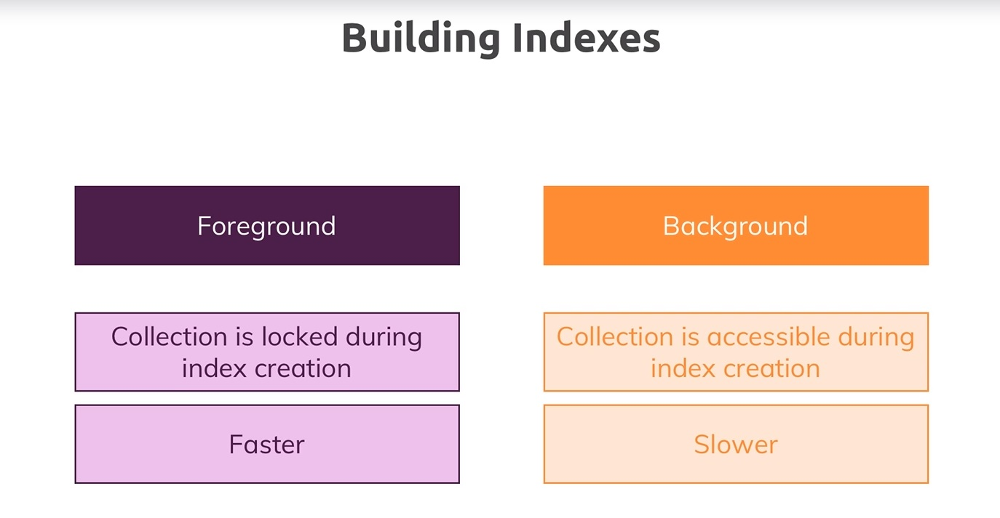. 
If you add your index in a foreground you lock your collection for writing. It's not suitable for production db. That's why you can use index creation in a background.
1) To create it in a standard way (foreground) - `dp.yourcollection.createIndex({field: 1})`.  
2) To create it in a background - `dp.yourcollection.createIndex({field: 1}, {background: true.})`

### Explain()
To understand what mongoDB did and how it derived results for any commands (except insert) you can use `explain`:

* Under `winning plan` you might notice stage: COLLSCAN. It means it looked throughout entire collection to find a result set.
* Also here is `rejectedPlans` - plans which were tried, but they were worse than winning by performance.
This property is an empty collection because of no plans except COLLSCAN to find all results in a current situation.

Explain has a bunch of commands:
`db.contacts.explain("executionStats").find({"dob.age": {$gt: 60}})` - detailed explanation.
* `"executionTimeMillis" : 0,` - tells you about execution time.
* ` "totalDocsExamined" : 5000,` - docs in our collection (because of COLLSCAN).  
Result before index:  
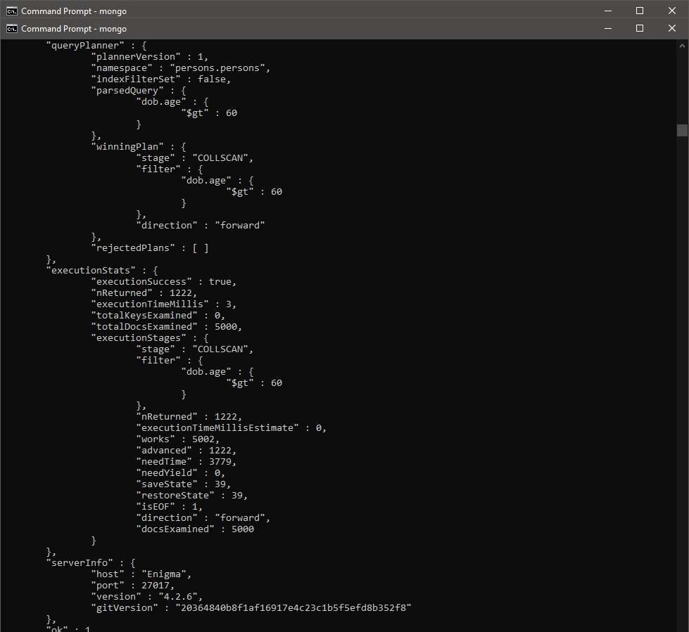  

### Index. Default index.
* To get all indexes you have to type:
`db.persons.getIndexes()`.  Mongodb always maintains the default index in _id field for you.

* To create an index you have to type:
`db.persons.createIndex({"dob.age": 1})`  
1 - for ascending order in the index.  
-1 - for descending order in the index.  
It doesn't make much sense except situations when you do sort of your results - it will speed up your query.  
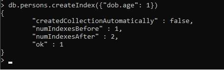

after that let's see how changed our query explanation:  
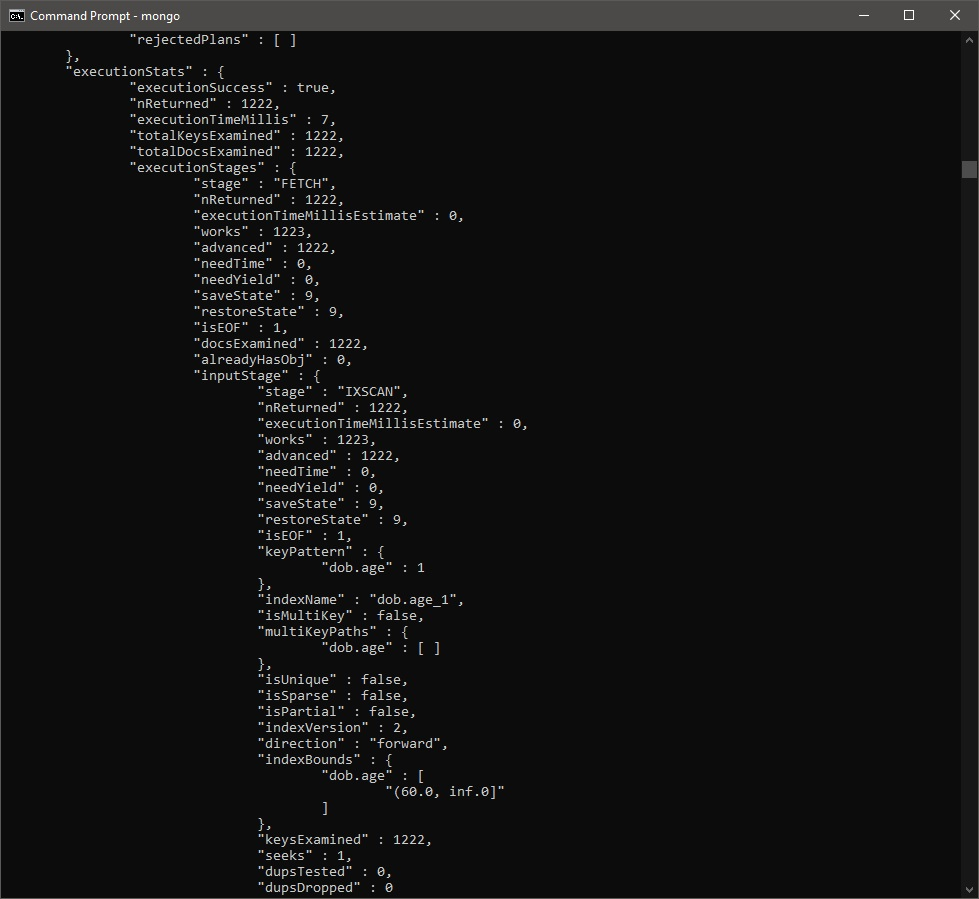  

Execution time downs to 3.  
And now you might see 2 stages in scan - `fetch` and `ixscan`:  
`ixscan` - goes through indexes to find needed keys (which fits our requirements).  
`fetch` - goes through the key collection and gets all results.

Other values could be compared with previous slide.

**Pay Attention**
* The restriction of index is the data fetching trying to find very common values or non-existent values:
`db.contacts.explain("executionStats").find({"dob.age": {$gt: 20}})` - this query will work twice slower than without indexes at all
because all our persons are older than 20, and our query must check all indexes and then - all records (5000 index keys + 5000 elements in collection).  
* Indexes are also inefficient for boolean (because of only 2 values) and for string field "gender" (for example).

Take care about your query scenarios. Indexes are very useful if your data spread well.

### Index, Parameters order in your query and index fields ordering.
if you create an index for 2 fields:  
`db.persons.createIndex({"dob.age": 1, name: 1})`  
It doesn't matter how you call your data:  
`db.persons.find({name: 'Max', age: {$gt: 29}})` or `db.persons.find({age: {$gt: 29}, name: 'Max'})`.  
Index will be applied for both. MongoDb automatically reverse parameters in query for us.

### Compound Index
To create compound index: `db.persons.createIndex({"dob.age": 1, gender: 1})`.  
Obviously this index would be helpful when you're using filter by age and gender.
**But pay attention**, despite how SQL works this compound index in mongodb will speed up your queries which filter only "dob.age".
1) It happened because indexes work from left to right and the `db.persons.find({"dob.age": {$gt: 35}})` will also use `"indexName: "dob.age_1_gender_1".` compound index.  
2) For `gender` alone it does not work.

### Indexes for Sorting
For ordering Mongodb uses only 42MB of internal storage (for fetched documents) and if you don't use indexes you can face with a timeout (when too much data for sorting, and mongo can't perform this action ).
That's why you need indexes not only to speed up your queries but also be able to make such query.

### Unique Index
`db.persons.createIndex({email: 1}, {unique: true})` - you have to simply add the parameter.

### Partial Index and Partial Filters
If would be useful if you need for example to query all people which are retired and older than 60.  
If you apply an index on your age field - your index would be unnecessary big. Index also eats your disk space.  
Partial indexes are drastically smaller and could be useful in some cases (for example, when you are looking persons only older than 60).  
In this situation you can apply a partial index:  
1) `db.persons.createIndex({"dob.age": 1}, {partialFilterExpression: {"dob.age": {$gt: 60} }})` - if your case just to filter all persons older than 60.  
2) `db.persons.createIndex({"dob.age": 1}, {partialFilterExpression: {gender: "male"}})` - but if you are filtering also by a male gender. -- This index will apply only for documents with a gender "male". 

**Be aware of the second index**  
What do i mean? I mean if you apply such index but you use the next query: `db.persons.find({"dob.age": {$gt: 60}})` - mongo will decide that it's too risky to use index with a gender because you do not use gender in filtering explicitly.  
To call it properly and use your recently created index: `db.persons.find({"dob.age": {$gt: 60}, gender: "male"})`.

To control what's going on and why - use `explain()`.

#### Non-existing values and unique indexes
Also, be aware. If you add an unique index for field - undefined value will be also a unique value, you can't add two documents **without** this field.
`db.persons.insertMany([{name: 'Max', email: "testemail@gmail.com"},{ name: 'Anna' }, { name: 'Gregor' }])` - second and third doc are without email. And if you have an unique index on `email` field - Mongodb does not allow you to perform such InsertMany.  
To avoid such situation just use a partial index and set existing: `db.persons.createIndex({email: 1}, {unique: true, partialFilterExpression: {email : {$exists: true}}})` 

### Time-To-Live (TTL) indexes
Such kind of indexes could be useful for self-destroying data like sessions of users.  
`db.sessions.insertOne({data: "randomtext", createdAt: new Date()})`
`db.sessions.createIndex({createdAt: 1}, {expireAfterSecond: 10})` - expireAfterSeconds parameter works only on date fields. It could be added but will be ignored. This parameter means that this element will be deleted after 10 second from adding it to collection.

### Multi-key index, index for array
* Multikey index is an index which apply to arrays. You can find a boolean "multiKey" field in you winning plan using explain().  
* Let's add some data: `db.persons.insertOne({name: "Max", hobbies: ["Cooking", "Sports"], addresses: [{street: "Main Street"}, {street: "Second Street"}]})`.  
And now:  
`db.persons.createIndex({hobbies: 1})`
They work like classic index, but it stores differently. It pulls out all key from array and stores as a separate element in your index.  
If your array has 4k elements - your index also will store 4k elements one per each element in the array. You should bear this in mind.  
* It's also possible to use index on the array of objects, but it will use COLLSCAN instead of IXSCAN with the next query:  
`db.persons.createIndex({addresses: 1})`  
After using `db.persons.explain("executionStats").find({"addresses.street": "Main Street"})`
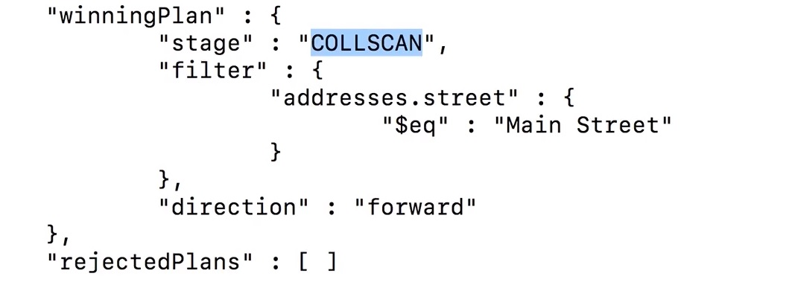.  
The reason of that, of course, because the index holds the whole documents, not the fields.  
* **BUT** If you change a bit your find operation to work with objects - it will work using IXSCAN:  
`db.persons.explain("executionStats").find({"addresses": {street: "Main Street"}})`
* Another capability is to create an index on another manner - on a field inside the documents:  
`db.persons.createIndex({"addresses.steet": 1})`. It also will be a multi-key index and will work like a charm with the `db.persons.explain("executionStats").find({"addresses.street": "Main Street"})`.

### Restrictions for array indexes
Restrictions relate to compound indexes for 2+ array fields.  
data: `db.persons.insertOne({name: "Max", hobbies: ["Cooking", "Sports"], addresses: [{street: "Main Street"}, {street: "Second Street"}]})`  
`db.persons.createIndex({name: 1, hobbies: 1})`. That does work. 1 multi-key(array) field. Another (name) is a string.
`db.persons.createIndex({addresses: 1, hobbies: 1})`. That does not work for 2 arrays fields.

Section 10: Text indexes, Sorting for them, Combined text indexes

#### Text indexes
* It's an ability to avoid regex using due it's not well performance.
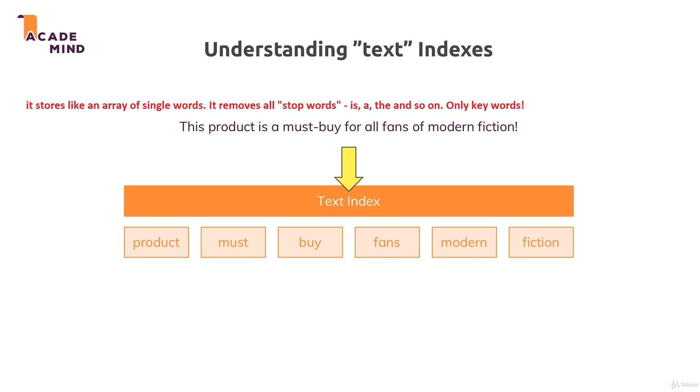  
How to properly create it:
`db.products.createIndex({description: "text"})` instead of `db.products.createIndex({description: 1})`.  
Will create a special index which allows you to search by a part of the description.

* To utilize it: `db.products.find({$text: {$search: "awesome"}})`.  
No worries about capital cases - all store in the index using lower-case.

* In base scenarios it doesn't really matter which order you place search words in. But sometimes it's important.
to use it with ordering you have to use "score" inside $search operator:
`db.products.find({$text: {$search: "awesome"}}, {score: {$meta: "textScore"}}).pretty()`
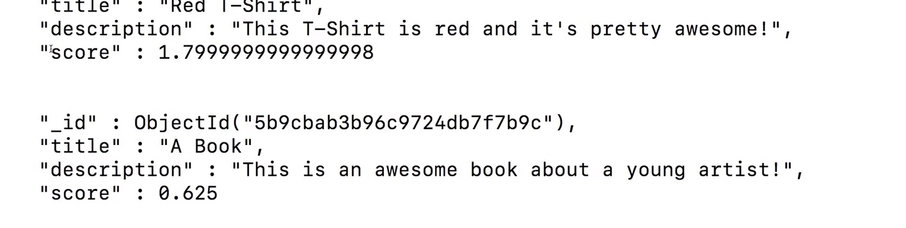
You can use it to order you result set or find the best result for you:  
`db.products.find({$text: {$search: "awesome"}}, {score: {$meta: "textScore"}}).sort({score: {$meta: "textScore"}}).pretty()`

#### Drop text index
You can't drop text index by field writing `db.products.dropIndex({title: "text"})`; It doesn't work.
But you can drop it using the index name:
`dp.products.getIndexes()` and then get name from "name" field (i.e. "description_text")  
`dp.products.dropIndex("description_text")`

#### Combined Text indexes
It's not possible to create several text indexes on one document! But we can merge several text field into one text index.  
1) you have to drop your previous text index
2) you can add a new one on multiple fields: `dp.products.createIndex({title: "text", description: "text"})`

It will let you search by several fields using index and `db.products.find({$text: {$search: "A Bool title"}})` (which comes from title field)

#### Exclude words from text indexes
To exclude words from search you can simply use -t key:  
`db.products.find({$text: {$search: "Awesome -t-shirt"}})` - will exclude texts where "shirt" appears.

#### Setting Default Language, using weights.
* Default language: 
To manually assign default language you can simply say: `dp.products.createIndex({title: "text", description: "text"}, {default_language: "german"})`.
There is a list of support languages, you can't type here whatever you want.
What it allows you? It defines which words and articles\stopwords\prefixes will be removed. ('is will be removed in English', 'ist' will be removed in German) 

But if you use different languages in different languages better to do next:
`db.products.find({$text: {$search: "A Bool title", $language: "german"}})`

* Weights:
When you create a combined index you can specify your field weights. It could be important when mongo calculates the score of the results.  
`dp.products.createIndex({title: "text", description: "text"}, {weights: {title: 1, description: 10}})` - description would be worth 10 times as much as title.   
To check your weights and how it affets the final score:  
`db.products.find({$text: {$search: "awesome"}}, {score: {$meta: "textScore"}}).pretty()`

#### Case sensitive
`db.products.find({$text: {$search: "A Bool title", $caseSensitive: true}})`

# Geospatial data, GeoJSON

Section 11: Geospatial Data

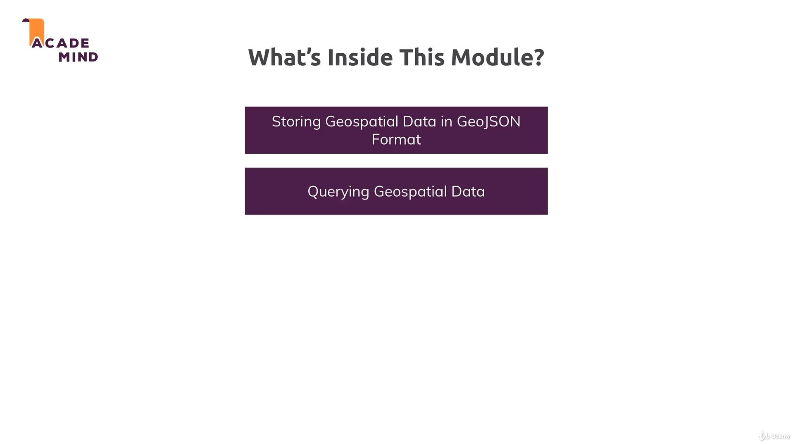

### Adding
Structure:  
`db.places.insertOne({name: "California Academy", location: { type: <GeoJSON type>, coordinates: <coordinates> }})`
To add a GeoJSON location you have to write the next (For Point type):  
`db.places.insertOne({name: "California Academy", location: { type: "Point", coordinates: [-122, 47] }})`

### Geo Query
#### To find what is near to the next point:  
`db.places.find({location: {$near: {$geometry: { type: "Pont", coordinates: [-122, 47]}}}})`  
location comes from our collection field, it is not a reserved word.

you can use $maxDistance and $minDistance as well (in meters):
`db.places.find({location: {$near: {$geometry: { type: "Pont", coordinates: [-122, 47]}, $maxDistance: 30, $minDistance: 10}}})`  

First, it will show you an error:  
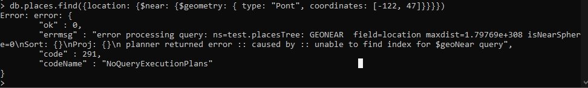
To let it work you have to add a special GeoJSON index to your collection.

#### To find something inside certain area (inside polygon):
create a variable to manipulate data easier:  
`const p1 = [-122.4547, 37.774]`
`const p2 = [-122.4503, 37.766]`
`const p3 = [-122.5102, 37.76411]`
`const p4 = [-122.51088, 37.7711]`

to Find all of our points inside this polygon:  
`db.places.find({location: {$geoWithin: {$geometry: {type: "Polygon", coordinates: [[p1,p2,p3,p4,p1]]}}}})` - pay attention on the array inside array!

#### To find out is a User inside area (find all areas which your point belongs to):
1) let's store our area inside database first.  
`db.areas.insertOne({name: "Golden Gate Park", area: {type: "Polygon", coordinates: [[[-122.4547, 37.774], [-122.4503, 37.766], [-122.5102, 37.76411], [-122.51088, 37.7711], [-122.4547, 37.774]]]}})`
2) create index (on area field): `db.areas.createIndex({area: "2dsphere"})`
3) find all areas where your point belongs to: $geoIntersects  `db.areas.find({area:{$geoIntersects: {$geometry: {type: "Point", coordinates: [-122.49089, 37.7699] } }}})`  
It will return you your area which was previously added in areas collection.

#### To find everything inside radius:
pay attention on 1/6378.1 - translation from kilometers to radians.
`db.places.find({location: {$geoWithin: {$centerSphere: [[-122.4620, 37.7286], 1 / 6378.1 ]}}})`

### Geospatial index
to add an index:  
`db.places.createIndex({location: "2dsphere"})` - 2dsphere is a special index format for geospatial data.
location comes from our collection field, it is not a reserved word.

Section 12: Aggregation Framework, Complex Transformations

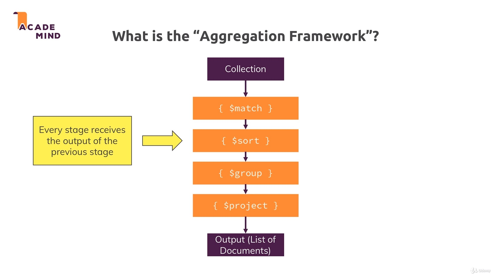
You can use pipeline stages in `db.collection.aggregate` and `db.aggregate methods`.  

**Pay attention**: aggregate use cursor, it will not loop up all your collection.
To speed up it you can use indexes to search through indexes first and take their advantages.

* You can use steps multiple times. For example you can use $project several times within aggregation.

* To use multiline insert(leave your brackets open):  
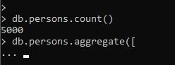

### Find stage using $match.
example: `db.persons.aggregate([
  {$match: {gender: "female"}},    
 ])`
 

### Group stage. Works like Group from SQL world.
It allows you to group your data by a field or by multiple fields (for example group by location and state):  

example: `db.persons.aggregate([
  {$match: {gender: "female"}},    
  {$group: { _id: { state: "$location.state" }, totalPersons: { $sum: 1 } }}   
 ])`
 
* as you might notice - syntax for _id field - we have never used it before. But for aggregation - it uses very often for _id field.
* $ sum - is an accumulator function - returns you a count of documents with certain state.

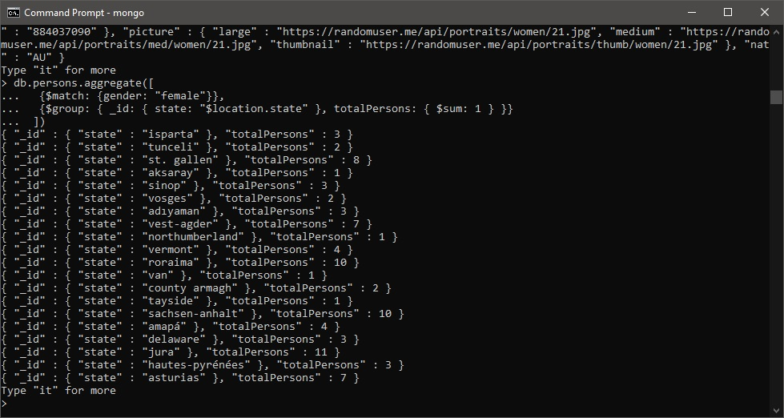

### Group with Sorting
is you add sort stage before grouping - you will sort your data right after filtering. It's not what we are looking for.
`db.persons.aggregate([
  {$match: {gender: "female"}},    
  {$group: { _id: { state: "$location.state" }, totalPersons: { $sum: 1 } }},
  {$sort: { totalPersons: -1 } }
 ])`
 
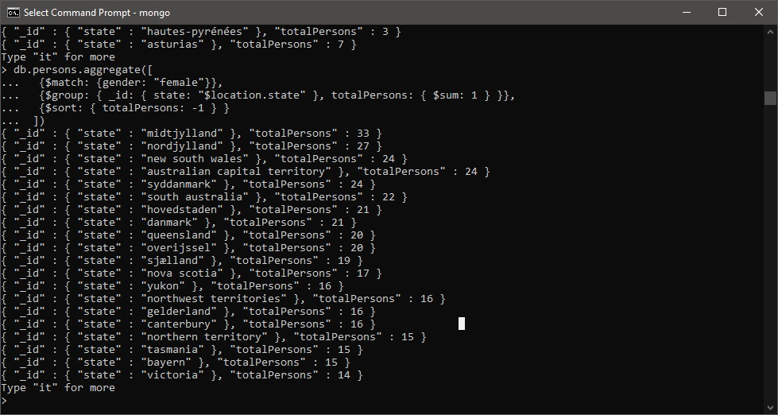

### $Project stage. More powerful than projection.
We can no only select which field should be included and which are not. We are also able to make new fields (take a look on fullName field):
* $concat, $toUpper are used.
* {$toUpper: {$substrCP: ["$name.first", 0, 1]}} - to uppercase the first char of the string derived from name.first field.

`db.persons.aggregate([
  {$project: { 
            _id: 0,
             gender: 1,
             fullName: {$concat: ["Hello", "World", " ", "$name.first", {$toUpper: "$name.last"}, {$toUpper: {$substrCP: ["$name.first", 0, 1]}}] }}}
 ])`
 
Show the first name with first character in the uppercase mode for first name and the last name:  
`db.persons.aggregate([
     {
       $project: {
         _id: 0,
         gender: 1,
         fullName: {
           $concat: [
             { $toUpper: { $substrCP: ['$name.first', 0, 1] } },
             {
               $substrCP: [
                 '$name.first',
                 1,
                 { $subtract: [{ $strLenCP: '$name.first' }, 1] }
               ]
             },
             ' ',
             { $toUpper: { $substrCP: ['$name.last', 0, 1] } },
             {
               $substrCP: [
                 '$name.last',
                 1,
                 { $subtract: [{ $strLenCP: '$name.last' }, 1] }
               ]
             }
           ]
         }
       }
     }
   ]).pretty();`

### Project to geoJSON
If you add a `name` field on the first $project step - you could use it on the second $project step.   
For example, we create a location as a geoJSON object on the first step and just include it on the second.  
If we do not specify fields on the first project but try to use on the second - they will just be omitted.  

`db.persons.aggregate([
  {$project: { name: 1, location: {type: "Point", coordinates: [ "$location.coordinates.longitude", "$location.coordinates.latitude" ] } } },
  {$project: { _id: 0, name: 1, gender: 1, location: 1 }} 
]).pretty()`

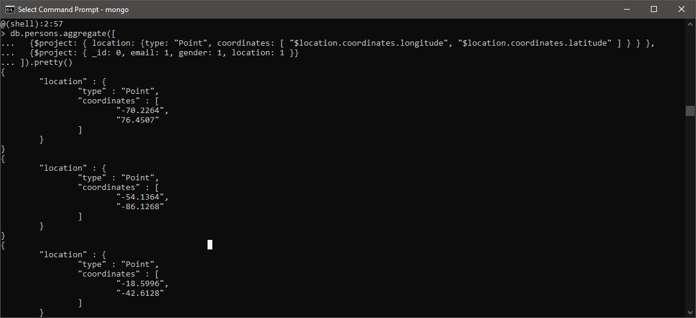

#### Converting geoJSON

* If you noticed lat and long are strings. We have to convert it using $convert:  
`db.persons.aggregate([
  {$project: { name: 1, location: {type: "Point", coordinates: [
                                                              { $convert: { input: "$location.coordinates.longitude", to: "double", onError: 0.0, onNull: 0.0 }},
                                                              { $convert: { input: "$location.coordinates.latitude", to: "double", onError: 0.0, onNull: 0.0 }}
                                                            ] } } },
  {$project: { _id: 0, name: 1, gender: 1, location: 1 } } 
]).pretty()`

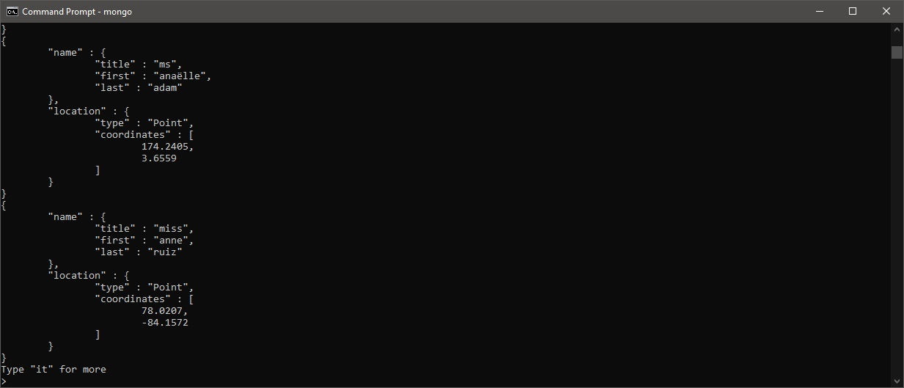

#### Converting Date with $convert
`db.persons.aggregate([
 { $project: { birthdate: { $convert: { input: "$dob.date", to: "date" } } }},
 { $project: { birthdate: 1 }}
]).pretty()`

#### Shortcuts
You can use shortcuts for convertion operations. For example: `toDate()`.
It can be useful if you don't worry about null values and exceptions.  
`db.persons.aggregate([
 { $project: { birthdate: { $toDate: "$dob.date" } } },
 { $project: { birthdate: 1 }}
]).pretty()`

### $isoWeekYear operator
Get the year from Date field
`db.persons.aggregate([
 { $project: { birthdate: { $toDate: "$dob.date" }}},
 { $group: { _id: { birthYear: { $isoWeekYear: "$birthdate"} }, personsAmount: { $sum: 1 } } }
]).pretty()`

### Group vs Project
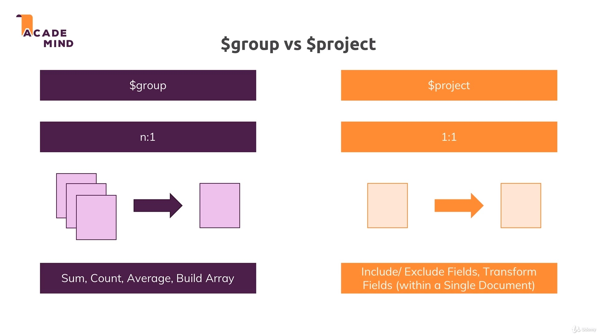

### $unwind
Using this aggregation operator you can easily get elements from arrays. Has 2 kind of syntax:
`db.persons.aggregate([
 { $unwind: "$hobbies" }
]).pretty()`

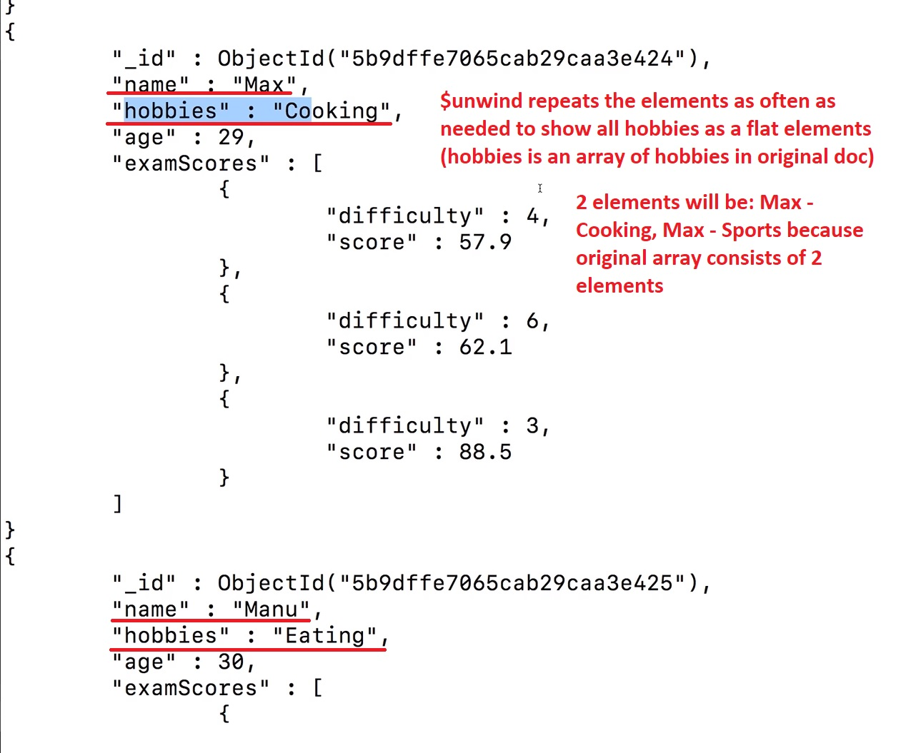

* We can bring them together using $group:
`db.persons.aggregate([
 { $unwind: "$hobbies" },
 { $group: { _id: { age: "$age" }}, allHobbies: { $push: "$hobbies" } }
]).pretty()`

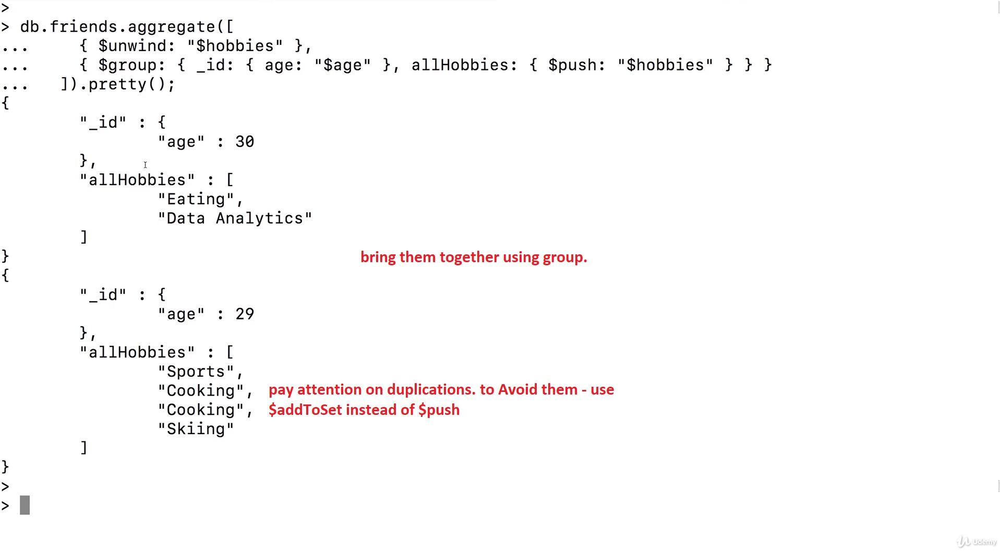
To avoid duplications: $addToSet.

### $project with Arrays:
You can use slice to arrays - to slice entire arrays on parts. You can use constants values here as well as variables.
`db.persons.aggregate([
 { $project: { _id: 0, examScore: { $slice: ["$examScores", 1] }}},
]).pretty()`

$slice: ["$examScores", 1] - will get first element from the array "examScores"
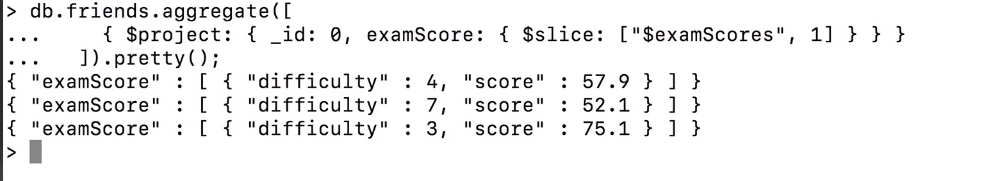

$slice: ["$examScores", -2] - will get last 2 elements. (negative values - will start counting from the end of the array)

$slice: ["$examScores", 2, 1] - will get 1 element starts from position 2.

#### $filter for projection
1) sc - temporary name (on your choice, in my case- shortcut of score) which could be used in projection
2) cond - condition.  $gt - works a bit differ than in filtering.
2.1) $gt: ["sc.score", 60] - sc.score variable greater than 60 (because every examScore element of the array - is a document)
`db.persons.aggregate([
 { $project: { _id: 0, examScore: { $filter: { input: "$examScores", as: "sc", cond: { $gt: ["sc", 60] } } }}},
]).pretty()`

#### $bucket
Allows you to output your data into the buckets where you can calculate summaries or statistics:  
1) using boundaries you can categorize you data by these values.
2) output - which fields should be presented: every document will have a field with $name.first value:
2.1) names - is will be a collection of first names
2.2) averageAge will contain avg year value respectively.
2.3) numPersons will contain a count of element inside bucket.
`db.persons.aggregate([
 { $bucket: { 
        groupBy: "$dob.age",
        boundaries: [0, 18, 30, 50, 80, 120],
        output: {
            numPersons: { $sum: 1 },
            averageAge: { $avg: "$dob.age" },
            names: { $push: "$name.first" }
        }
   }
 }
]).pretty()`  

the result is:
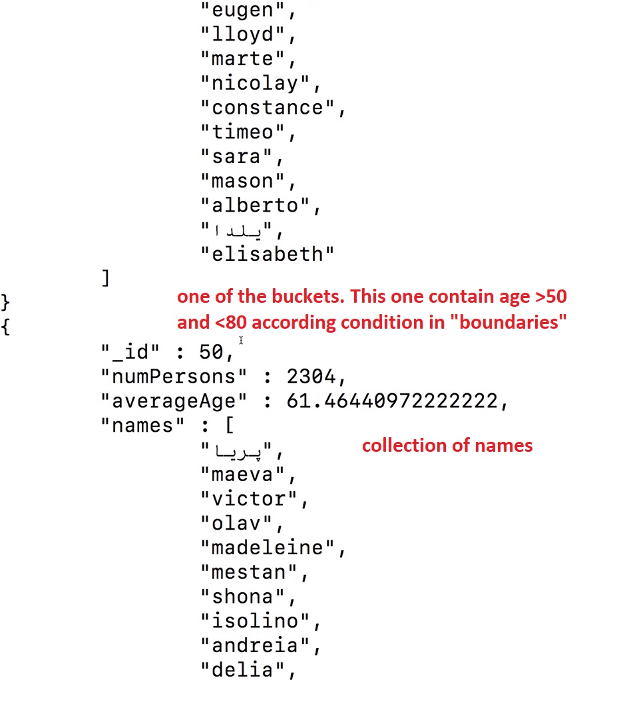

without names:
`db.persons.aggregate([
 { $bucket: { 
        groupBy: "$dob.age",
        boundaries: [0, 18, 30, 50, 80, 120],
        output: {
            numPersons: { $sum: 1 },
            averageAge: { $avg: "$dob.age" },
        }
   }
 }
]).pretty()`  

the result is:
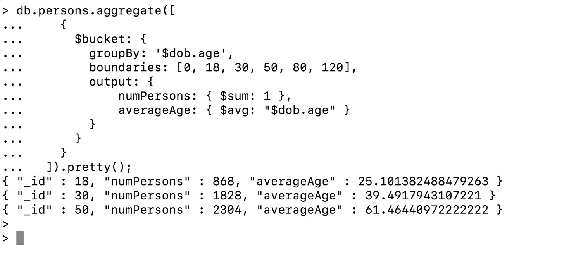

#### $bucketAuto
Allows you to create automatically defined bucket groups.  
1) buckets here is a count of buckets which you want to get. This field is optional.
`db.persons.aggregate([
 { $bucketAuto: { 
        groupBy: "$dob.age",
        buckets: 5,
        output: {
            numPersons: { $sum: 1 },
            averageAge: { $avg: "$dob.age" },
        }
   }
 }
]).pretty()`  

With BucketAuto mongo tries to derive groups with equal distribution (with equal amount of elements). That's why amount of elements in each group will be pretty close.

if you have no documents with age between >0 and <18 (and between >80 and <120) - the bucket won't be created. That's because you see only 3 buckets instead of 5.

#### $limit, $skip
1) Limiting your aggregation result set like TOP 10:
2) $skip allows you to skip first 10 inserts. (OFFSET (@Skip) in SQL world)
`db.persons.aggregate([
 { $project: { birthdate: { $toDate: "$dob.date" }}},
 { $group: { _id: { birthYear: { $isoWeekYear: "$birthdate"} }, personsAmount: { $sum: 1 } } }
 { $limit: 10 }
 { $skip: 10 }
]).pretty()`

**Pay Attention** The order here does matter (instead of ordering in find method) because aggregation executes step by step

#### $out
out allows you to send result into another collection (if you need to store them somewhere else or store + speed up next fetching):
`db.persons.aggregate([
 { $project: { birthdate: { $toDate: "$dob.date" }}},
 { $group: { _id: { birthYear: { $isoWeekYear: "$birthdate"} }, personsAmount: { $sum: 1 } } }
 { $limit: 10 }
 { $skip: 10 }
 { $out: "transformedData" }
]).pretty()`

Will send it into transformedData collection, and if it does not exist - will create it first. In this collection you can use indexes on the fields to find results faster.

#### #geoNear
Allows you to use geoJSON data and geoJSON indexes:
1) `db.transformedPersons.createIndex({ location: "2dsphere"})`
2) num - allows you to limit your result set instead of using $limit due performance difference.
3) query - allows you to filter by other things. Better to use query inside $geoNear than $match step, also because it works faster.
4) distanceField - field which you can specify to store distance information (between declared point+coordinates and others points which is near than 10km(according maxDistance))

`db.transformedPersons.aggregate([
 { $geoNear: {
     near: { type: "Point", coordinates: [-18.4, -42.8] },
     maxDistance: 10000,
     num: 10,
     query: { age: {$gt: 30 } },
     distanceField: "distance"
 }}
]).pretty()`

Mongo automatically optimizes your aggregation: [info](https://docs.mongodb.com/manual/core/aggregation-pipeline-optimization/)  
Other operators for $project: [project operators](https://docs.mongodb.com/manual/reference/operator/aggregation/project/)  

Module summary:
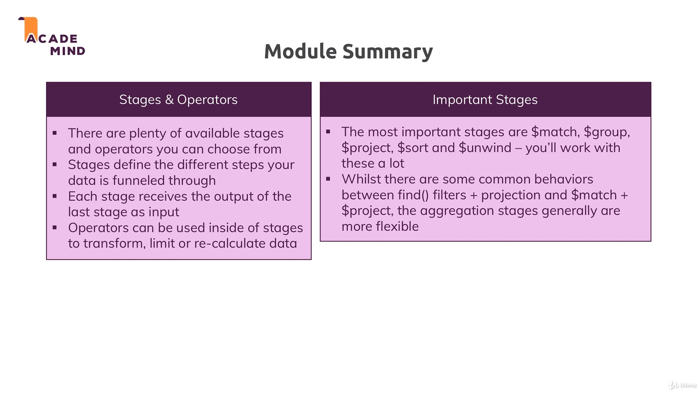

Section 13: Numeric Data

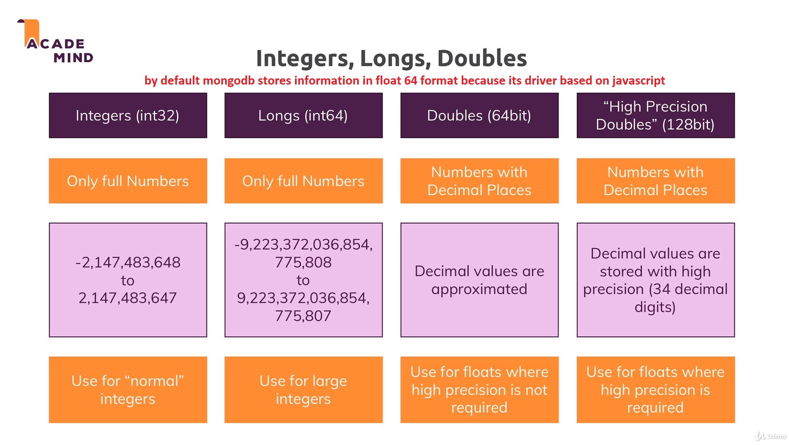

### Int32
To insert a value of default type (float) into collection: `db.persons.insertOne({age: 29})`.  
To insert a number: `db.persons.insertOne({age: NumberInt(29)})` or `db.persons.insertOne({age: NumberInt("29")})`
It works in the shell. To use it in a driver - use provided capabilities.  

To check: `db.persons.stats()` and check the size property (the second one).

**Pay attention**: it you add a value which is out of range of Int32 - it will insert the possible maximum (and we don't get an error):  
`db.company.insertOne({valuation: Number("500000000000")})` -> valuation will be 705032704

### Int64
To add Int64 value (also for shell): `db.company.insertOne({valuation: NumberLong(50000000000)})` or `db.company.insertOne({valuation: NumberLong("50000000000")})`.  
To check: `db.persons.stats()` and check the size property (the second one).

**Pay attention**: despite NumberInt behavious NumberLong raises an error if you reach the long value limit. But if you inserting it using string (with quotation marks) - it will store a maximum of possible values.

Also, keep in mind that Javascript (shell behind the driver) - use string instead of real numbers. that's why it supports both types of inserting (with quotation marks and without them).

### Converting from Numbers to default Float
If you make any operations with your NumberInt \ NumberLong adding-subtracting default type value - mongodb with automatically converts your value into float (default format):
`db.accounts.updateOne({}, {$inc: {amount: 10}})` - increase amount field by 10.

### Double 128-bit
Works quite well for 0 - 0.5 operations.
`db.science.insertOne({value: NumberDecimal("0.3")})` - we should pass it as a string to avoid imprecision issues.

### Monetary data
[monetary data](https://docs.mongodb.com/manual/tutorial/model-monetary-data/)

# Security, Durability & Fault Tolerance, Performance

Section 14: Security

#### Role based Access Control

Section 15: Fault Tolerance, Performance, Deployment

Section 16: Transactions

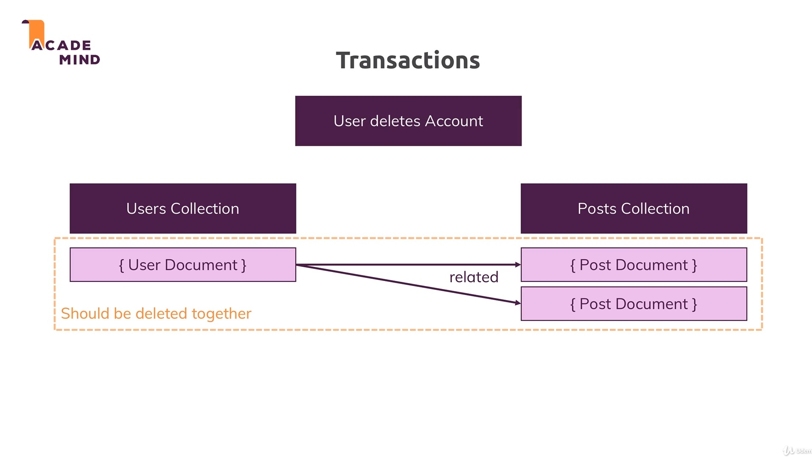
Transaction works along with sessions (next example works in Atlas and in shell):
0) store the user inside "blog" collection, store posts inside "posts" collection.
1) `const session = db.getMongo().startSession()` - create session
2) `session.startTransaction()` - start session and transaction inside it
3.1) `const usersCollection = session.getDatabases("blog").users`
3.2) `const postsCollection = session.getDatabases("blog").posts`
3.3) before making any operations we possibly need to get ObjectId of stored user using `db.users.find.pretty()` - it will go outside session.
3.4) And now we can use our general operations inside session using our stored session collections : `usersCollection.deleteOne({_id: ObjectId("PUT HERE YOUR ID")})`
3.5) if you check `db.users.find().pretty()` your collection - you will find your user here because transaction is not completed yet.
3.6) `session.startTransaction()` - to start your transaction (and operations related to usersCollection and postsCollection).
3.7) `session.commitTransaction()` - to commit your session with transaction, `session.abortTransaction()` - to abort your session.

